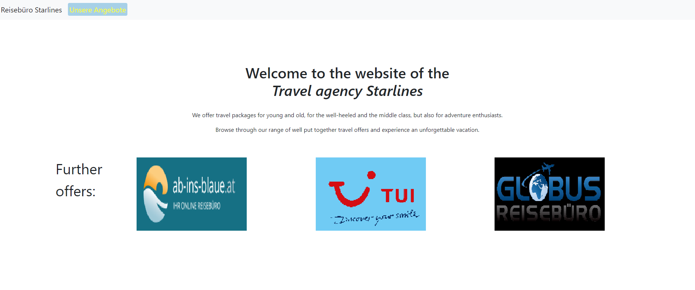
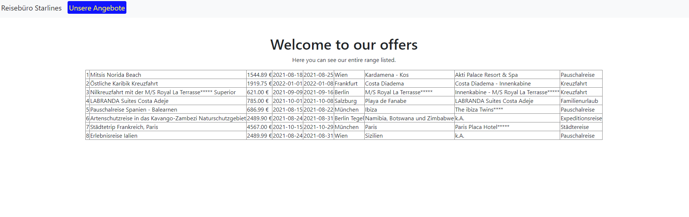

# Travel Agency Website

## :newspaper: About the project

Welcome to your ultimate travel booking destination! Our innovative travel agency website is designed to make your dream vacations a reality with just a few clicks. Explore a world of possibilities and book your next adventure effortlessly. Whether you're planning a tropical getaway or a cultural expedition, our platform offers unparalleled ease and convenience.

Dive into a seamless booking experience and discover the magic of travel with us. Plus, enhance your knowledge of PHP and web development as you navigate our cutting-edge features. Get ready to embark on unforgettable journeys and broaden your horizons both as a traveler and a tech enthusiast. Your adventure starts here!

### Directory structure

    .
    ├── classes
        └── Database.php - all functions for database  
    ├── css
        └── blink.css - styling for blinking text on site
    ├── db
        └── reisen.sql - travel offers stored in database
    ├── images - images and icons
        └── ...
    ├── includes - templates
        └── ...
    ├── considerations.txt - precomsiderations for the website
    ├── index.php - website entry point
    ├── LICENSE
    ├── README.md - provides project overview and information
    └── voyages.php - use case diagram

## :runner: Getting started

### Prerequisites

0. download and install [XAMPP Apache + MariaDB + PHP + Perl](https://www.apachefriends.org/de/index.html)

### Run the website

1. start xampp control panel and start __Apache__ and __MySQL__
   
2. place the downloaded and extracted files in __htdocs__

3. open <code>loclahost/travel-agency/index.php</code> in browser of your choice:

4. Main page:

5. Database:

## :books: Resources used to create this project

* PHP
  * [Documentation](https://www.php.net/docs.php)
* HTML
  * [HTML: HyperText Markup Language](https://developer.mozilla.org/en-US/docs/Web/HTML)
* CSS
  * [CSS: Cascading Style Sheets - MDN Web Docs](https://developer.mozilla.org/en-US/docs/Web/CSS?retiredLocale=de)
* Editor
  * [Visual Studio Code](https://code.visualstudio.com/)
* Frameworks
  * [XAMPP Documentation](https://www.apachefriends.org/docs/)
  * [Laravel](https://laravel.com/docs/11.x)
* Markdwon
  * [Basic syntax](https://www.markdownguide.org/basic-syntax/)
  * [Complete list of github markdown emofis](https://dev.to/nikolab/complete-list-of-github-markdown-emoji-markup-5aia)
  * [Awesome template](http://github.com/Human-Activity-Recognition/blob/main/README.md)
  * [.gitignore file](https://git-scm.com/docs/gitignore)

## License

This project is licensed under the terms of the [MIT License](LICENSE).

## COPYRIGHT

See the [COPYRIGHT](COPYRIGHT) file for copyright and licensing details.

## Code of Conduct

Please review our [Code of Conduct](CODE_OF_CONDUCT.md) before contributing to this project.
